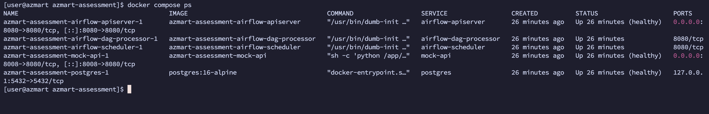
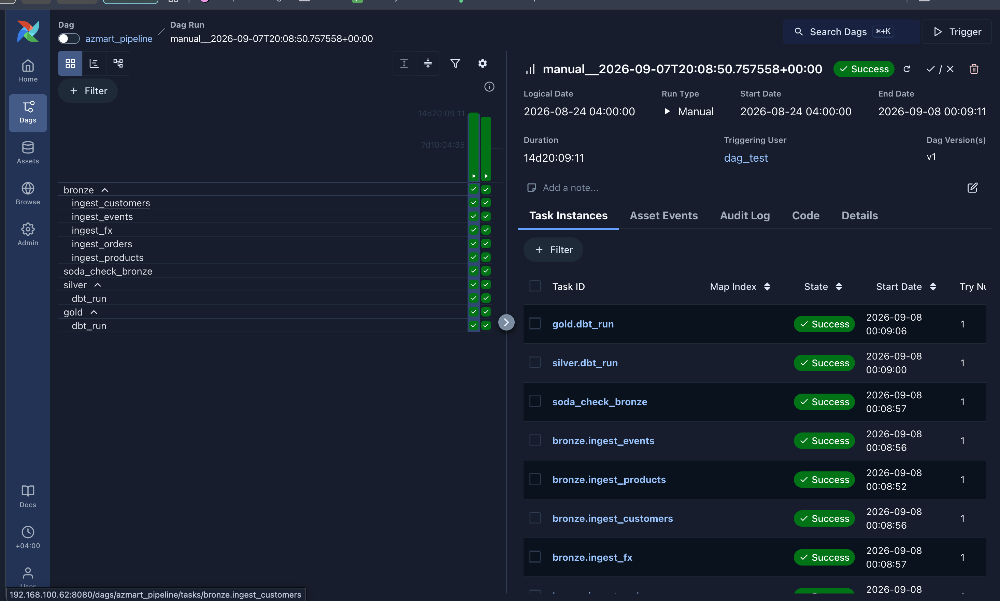
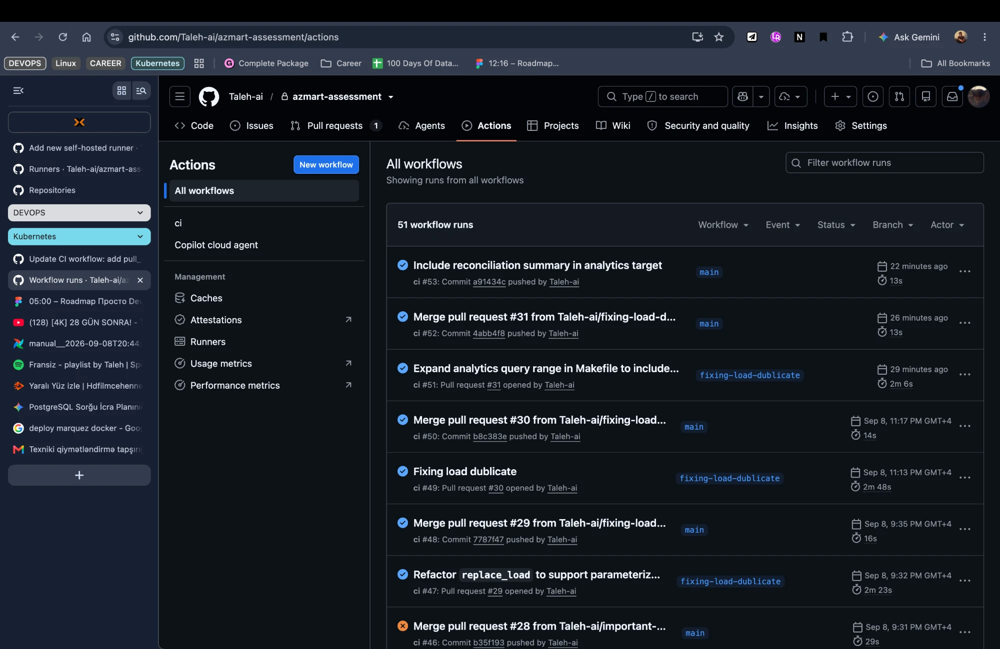
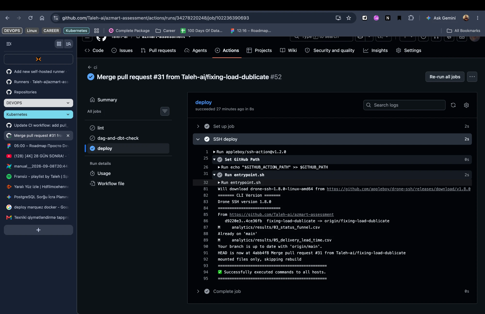

# azmart-assessment

AZCON Holding üçün Data Engineer texniki tapşırığı — "AZMART" marketplace, uçdan-uca Medallion pipeline (bronze/silver/gold).

## Setup (15 dəqiqə)

Tələb olunur: Docker + Docker Compose.

```bash
make bootstrap
```

Bu tək komanda 6 servisi qaldırır: `postgres`, `mock-api`, `airflow-init`, `airflow-apiserver`, `airflow-scheduler`, `airflow-dag-processor`. Asılılıqlar healthcheck üzərindən sıralanıb, ayrıca addım lazım deyil.

Yoxlamaq üçün:
- Airflow UI: `http://localhost:8080` (login tələb olunmur — `SIMPLE_AUTH_MANAGER_ALL_ADMINS=true`, avtomatik admin girişi)
- Mock API: `http://localhost:8008/health`

DAG (`azmart_pipeline`) defolt olaraq **paused**-dur (`start_date=2026-01-01`, `catchup=True` — unpause etsən 1 yanvardan bugünə qədər avtomatik backfill başlayar, mock API-yə çoxlu sorğu göndərər). Əl ilə 3 gün üçün test etmək üçün:

```bash
make run
```

`make run` əvvəlcə tarixi `orders`/`fx` datasını (`2026-01-01 → 2026-08-24`) birbaşa yükləyir (FX as-of-backward join-in tam işləməsi üçün tarixçə lazımdır), sonra `2026-08-24`/`2026-08-25` (customers/events faylı olan, tələb olunan interval-lar) günlərini DAG üzərindən işlədir.

dbt testlərini ayrıca işlətmək üçün:
```bash
make dbt-test
```

Analitika sorğularını (`analytics/queries/`) real dataya qarşı yenidən işlədib nəticələri CSV-ə yazmaq üçün:
```bash
make analytics
```

Lineage/catalog (Marquez + OpenLineage, Bonus B4) üçün:
```bash
make lineage
```
Bu, Marquez-i qaldırır (compose-da `lineage` profili altındadır — adi `make bootstrap` onu qaldırmır, ona görə setup yavaşlamır) və `dbt-ol build` ilə real run-un lineage-ini ora göndərir. UI: `http://localhost:3000`, namespace `azmart`. Dayandırmaq üçün `make lineage-down`.

## Sübut (evidence)

`docker compose ps` — 6 servis healthy:



Airflow DAG-ın uğurlu run tarixçəsi:



Ətraflı log-lar: `evidence/ingestion/` (429/500 retry-lar), `evidence/airflow/` (`dags test` çıxışı), `evidence/dbt/`, `evidence/soda/`.

CI/CD (`main`-ə merge → self-hosted runner → SSH deploy) real run-da işləyir, o cümlədən şərtli rebuild məntiqi (yalnız Dockerfile/requirements/compose dəyişəndə `docker compose up -d --build`, əks halda `git reset --hard` kifayətdir, çünki dags/dbt_project/soda bind-mount-dur):



Deploy job-un log-u — `"mounted files only, skipping rebuild"` sətri şərtli rebuild-in real işlədiyinin sübutudur:



## Arxitektura xülasəsi

- **Warehouse:** PostgreSQL 16 (bir instans, iki database: `airflow_meta`, `azmart`). DuckDB yox — Hissə 4-də paralel bronze task-lar üçün MVCC lazımdır.
- **Orkestrasiya:** Airflow 3, `LocalExecutor`. DAG: `bronze` (5 paralel ingestion task) → `silver` (`dbt build`, staging+silver modelləri) → `gold` (`dbt build`, star schema).
- **Transformasiya:** dbt-core + dbt-postgres. `models/staging/` (parse + `reason_code`) → `models/silver/` (təmiz + `quarantine.*`) → `models/gold/` (star schema).
- **Bronze:** xam saxlanır (`payload jsonb` + `_source`/`_batch_id`/`_load_id`/`_ingested_at`), cast/dedup/təmizləmə yoxdur.
- **Silver:** standartlaşdırma (currency, 4 timestamp formatı, comma-string rəqəmlər, referential integrity) + quarantine pattern (rədd edilən sətirlər silinmir, `reason_code` ilə ayrı cədvələ düşür).
- **Gold:** star schema — `dim_customer` (SCD2), `dim_product`, `dim_date`, `fct_order_lines` (grain: order line), `fct_order_status_events` (grain: status event).
- **CI/CD:** GitHub Actions — PR-da `lint` (ruff) + `dag-and-dbt-check` (DAG import + `dbt parse`), `main`-ə merge-də self-hosted runner üzərindən SSH deploy.

Ətraflı: [ARCHITECTURE.md](ARCHITECTURE.md), [DQ_REPORT.md](DQ_REPORT.md), [AI_USAGE.md](AI_USAGE.md).

## Fərziyyələr və qərarlar

- **Status source of truth:** event-lər (CDC) API snapshot-undan üstün tutulur — event stream real-vaxt, API isə periodik snapshot-dur. Yalnız event olmayan sifarişlərdə (219/5200, event faylları cəmi 2 günü əhatə etdiyi üçün gözlənilir) API statusuna keçilir. Ətraflı: [DQ_REPORT.md](DQ_REPORT.md).
- **Tombstone (`op:"d"`):** sətir silinmir, `final_status` hesablanmasında əvvəlki bilinən status saxlanılır (maliyyə tarixçəsi pozulmasın deyə).
- **SCD2 (`dim_customer`):** `dbt snapshot` yox — 2 snapshot eyni anda bronze-da oturduğu üçün tarixçə yaratmazdı. Sahə-sahə müqayisə (`day1`/`day2` window) ilə SQL-də deterministik qurulub. İlk versiyanın `valid_from`-u `2020-01-01`-ə sabitlənib ki, avqustdan əvvəlki sifarişlər də uyğun versiyaya düşsün (real müştəri tarixçəmiz cəmi 2 gündür).
- **Legacy currency (`AZM`):** real konversiya nisbəti (5000:1, 2006 denominasiyası) bilinmədiyi üçün quarantine edilib, təxmini konversiya edilməyib.
- **Eyni batch daxilində dublikat (orders):** bronze silmir, silver-də son `updated_at` qalır.

## İş jurnalı

### 2 sentyabr
- Repo, `.gitignore`/`.dockerignore`, `uv` ilə mühit (`pyproject.toml` + `uv.lock`)
- `docker-compose.yaml`: mock-api (socat sidecar) + Postgres — `airflow_meta` və `azmart` (bronze/silver/gold/quarantine), healthcheck-lər
- `ingestion/api_client.py`: X-API-Key, timeout, cursor pagination, 429→`Retry-After`, 5xx→exponential backoff, 4xx→dərhal xəta
- API datası profilləndi, 18 DQ problemi say və nümunə ID ilə qeyd olundu

### 3 sentyabr
- `docker-compose.yaml`-a Airflow əlavə olundu: `init` → `apiserver` → `scheduler` / `dag-processor`, asılılıqlar healthcheck üzərindən
- `docker/initdb/` skriptləri: `airflow_meta` bazası, `azmart` içində `bronze` / `silver` / `gold` / `quarantine` sxemləri

### 4 sentyabr
- `docker/Dockerfile.app` və `requirements-app.txt` — dbt və Soda Airflow image-ının içinə əlavə olundu (ayrıca servis kimi yox, `BashOperator` çağırır)
- dbt və Soda üçün mount-lar və env dəyişənləri compose-a əvvəlcədən yazıldı: `DBT_PROFILES_DIR`, `DBT_TARGET_PATH`, `POSTGRES_*`
- Bütün stack sıfırdan qaldırıldı və yoxlandı — 6 servis healthy, Airflow UI açılır, `dbt --version` konteynerdə işləyir

### 5 sentyabr
- Bronze loaderlər: `customers`, `products`, `events` (+ `quarantine.records`, malformed sətirlər üçün)
- Airflow DAG (`dags/azmart_pipeline.py`): `bronze` TaskGroup, 5 paralel ingestion task-ı, `data_interval`-driven, `catchup=True`, `max_active_runs=1`
- Hər bronze sətrinə `_batch_id` (hər run üçün fərqli UUID, audit trace) əlavə olundu — `_source`/`_load_id`/`_ingested_at`-a əlavə olaraq
- **Qərar — eyni batch daxilində dublikat order_id-lər:** bronze bunları **silmir** Bronze fəlsəfəsi "xam, dəyişdirilməmiş" olduğu üçün dedup burda deyil, silver-də (dbt) deterministik qayda ilə (məs. son `updated_at`) həll olunacaq.

### 6 sentyabr
- CI/CD: `.github/workflows/ci.yml` — PR-da lint+dbt-check, `main`-ə push-da self-hosted runner ilə SSH deploy
- Silver layeri bitirildi: `orders`/`customers`/`products`/`events` (CDC) — hamısı `stg_*` → təmiz + `quarantine.*` naxışı ilə
- Testlər yazıldı və yoxlanıldı: description + `not_null`/`unique`/`accepted_values` + grain testi, `dbt build` real datada 27/27 PASS
- dbt qovluq strukturu təmizləndi: `staging/` (parse) və `silver/` (nəticə) ayrıldı

### 7 sentyabr
- Gold layeri bitirildi: star schema tam — `dim_customer` (SCD2), `dim_product`, `dim_date`, `fct_order_lines`, `fct_order_status_events`, 2 məcburi test (grain+revenue reconciliation), `dbt build` 46/46 PASS
- Airflow: DAG `bronze → silver → gold` ayrı TaskGroup-lara bölündü, failure callback stub əlavə olundu, evidence `evidence/airflow/`-da saxlanıldı
- Analitika bitirildi: 5 sorğu + nəticələr (`analytics/`), EXPLAIN təhlili, pipeline-generated reconciliation sorğusu
- `DQ_REPORT.md`, bu README, `ARCHITECTURE.md`, `AI_USAGE.md` yazıldı
- `Makefile` yaradıldı (`bootstrap`/`run`/`dbt-test`/`analytics`)
- Nəticə: real serverdə sıfırdan `make bootstrap && make run` işlədilib, DQ_REPORT.md-dəki bütün rəqəmlər (quarantine 15/1/3/1/1, reconciliation 27) iki müstəqil mühitdə eyni çıxdı

### 8 sentyabr
- Bug tapıldı və düzəldildi: `stg_order_lines`-da `order_ts`-in `DD.MM.YYYY` formatının ikiqat timezone konversiyası (8 saatlıq səhv, 416 sətir)
- `DAGS_ARE_PAUSED_AT_CREATION` `"false"` → `"true"` — fresh DAG-ın yaradılışda avtomatik unpause olması riski bağlandı
- Soda DQ gate DAG-a əlavə olundu (`soda_check_bronze`), bilərəkdən `customers`/`events`-i xaric edir (skip-cascade riskindən qorunmaq üçün)
- Assessment spesifikasiyası ilə tam audit aparıldı: 2 boşluq tapıldı (`evidence/ingestion/` çatışmırdı, analitika CSV-ləri köhnəlmişdi) — ikisi də real serverdə real evidence ilə bağlandı

### 9 sentyabr
- **Qərar — bronze reload idempotentliyi:** `_load_id`-ə əsaslanan `DELETE` yalnız tam eyni load_id-ni silirdi — fərqli, üst-üstə düşən intervallı reload (məs. iki fərqli backfill komandası) dublikat yaradırdı. `ingest_orders`/`ingest_fx`-in `DELETE`-i load_id-dən tarix-aralığı-əsaslıya (`updated_at`/`rate_date`) keçirildi — real overlap ssenarisi ilə test edildi, dublikat sıfır.
- **dbt incremental:** `order_lines`, `order_lines_rejected`, `order_status_history`, `order_status_history_rejected`, `fct_order_status_events` → `materialized='incremental'` (delete+insert, grain üzrə `unique_key`). `fct_order_lines` şüurlu şəkildə full-refresh saxlanıldı — o, iki müstəqil mənbədən (orders snapshot + CDC event axını) asılıdır, tək cursor hər ikisini düzgün əhatə edə bilməzdi. Full-refresh baseline ilə incremental nəticə bit-bə-bit eyni olduğu təsdiqləndi.
- CI/CD: `docker compose up -d --build` yalnız Dockerfile/requirements/compose dəyişəndə işə düşür — DAG/dbt/soda dəyişikliyi (bind-mount olduğu üçün) rebuild tələb etmir.
- `analytics/queries/00_reconciliation_summary.sql`-in nəticəsi `make analytics`-ə əlavə olundu və commit edildi.
